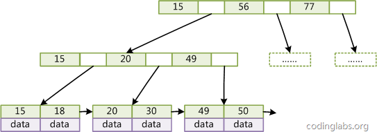
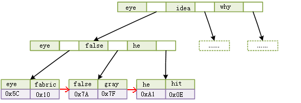

### mysql索引结构

#### 索引：是帮助MySQL高效获取数据的数据结构。

数据本身的组织结构不可能完全满足各种数据结构，所以在数据之外，数据库系统还维护着满足特定查找算法的数据结构，
这些数据结构以某种方式引用（指向）数据，这样就可以在这些数据结构上实现高级查找算法。这种数据结构就是索引。

系统从磁盘读取数据到内存时是以磁盘块为基本单位的。InnoDB存储引擎中有页的概念，页是其磁盘管理的最小单位。

磁盘I/O 操作是影响整个B-Tree查找效率的决定因素。

#### B+Tree

所有数据记录节点都是按照键值大小顺序存放在同一层的叶子节点上，非叶子节点只存储键值信息。

#### 与 B-Tree 不同

1. 非叶子节点只存储键值信息
2. 所有叶子节点之间都有一个链指针
3. 数据记录都存放在叶子节点中

#### 为什么使用 B-Tree

一般来说，索引本身也很大，不可能却不存储在内存中，因此索引往往是以索引文件的形式存储在磁盘上。
因此查找索引的过程中就要产生磁盘I/O消耗，相对于内存存取，I/O存取的消耗要高几个数量级，
所以评价一个数据结构作为索引的优劣最重要的指标就是在查找过程中磁盘I/O 操作次数的渐进复杂度。

索引的结构组织要尽量减少查找过程中磁盘I/O 的存取次数。

#### 聚簇索引和非聚簇索引

1、 聚簇索引

指主索引文件和数据文件为同一份文件，聚簇索引主要用在 InnoDB 存储引擎中。
在该索引实现方式中，B+Tree 的叶子节点上的 data 就是数据本身，key 为主键。
如果是一般索引的话，data 便会指向对应的主索引。

B+Tree 的每个叶子节点增加一个指向相邻叶子节点的指针，就形成了带有顺序访问指针的 B+Tree。
这个优化的目的是为了提高区间访问的性能。
例如上图查询 key 为18 到 49 的所有数据记录，当找到 18 后，只需顺着节点和指针顺序遍历就可以一次性访问到所有数据节点，极大提高了区间查询效率。

2、 非聚簇索引
指 B+Tree 的叶子节点上的 data，并不是数据本身，二十数据存放的地址。
主索引和辅助索引没啥区别，只是主索引中的 key 一定得是唯一的。 主要用在MyISAM存储引擎中。

非聚簇索引比聚簇索引多了一次读取数据的 IO 操作，查找性能会差。

#### InnoDB 索引实现
1、 InnoDB 的数据文件本身就是索引文件。叶节点 data 域保存了完整的数据记录。这个索引的 key 是数据表的主键。
2、 InnoDB 的辅助索引 data 域存储相应记录主键的值而不是地址。 所有辅助索引都引用主键作为 data 域。

辅助索引搜索需要检索两遍索引：首先检索辅助索引获得主键，然后用主键到主索引中检索获得记录。

不建议使用过长的字段作为主键，因为所有辅助索引都引用主索引，过长的主索引会令辅助索引变得过大。

非单调的字段作为主键不是个好主意，会造成在插入新记录时数据文件为了维持 B+Tree 特性而频繁的分裂调整，十分低效，所有使用自增字段作为主键。

对于 InnoDB 而言，因为节点下有数据文件，因此节点的分裂将会比较慢。对于主键，尽量用整型，而且时递增的。

#### InnoDB 索引和 MyISAM 索引的区别
1、 主索引的区别。 前者数据文件本身就是索引文件。后者是分开的。
2、 辅助索引的区别。 前者的辅助索引 data 域存储相应记录主键的值而不是地址。后者辅助索引和主索引没有多大区别。

#### 索引覆盖
指 如果查询的列恰好是索引的一部分，那么查询只需要在索引文件上进行，不需要回到磁盘再找数据。
