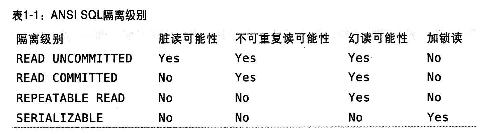

### 事务

事务就是一组原子性的 SQL 查询，或者说一个独立的工作单元。 如果数据库引擎能够成功地对数据库应用该组查询的全部语句，那么久执行该组查询。 如果其中有任何一条语句因为崩溃或其他原因无法执行，那么所有的语句都不会执行。

也就是说，事务内的语句，要么全部执行成功，要么失败。

START TRANSACTION; 语句 开始一个事务。 然后要么使用 COMMIT 提交事务修改的数据持久保留，要么使用 ROLLBACK 撤销所有的修改。

#### ACID

- 原子性 （atomicity）
    - 一个事务必须被视为不可分割的最小工作单元，整个事务的操作要么全部提交成功，要么全部失败回滚，对于一个事务来说，不可能只执行其中的一部分操作。
- 一致性 （consistency）
    - 数据库总是从一个一致性的状态转换到另一个一致性的状态。 一致性确保了，执行其中语句之间时系统崩溃，因为最终事务没有提交，所以事务所做的修改也不会保存到数据库中。
- 隔离性 （isolation）
    - 通常来说，一个事务所做的修改在最终提交以前，对其他事务是不可见的。
- 持久性 （durability）
    - 一旦事务提交，所做的修改就会永久保存到数据库中。此时及时系统崩溃，修改的数据也不会丢失。

#### 隔离级别

- READ UNCOMMITTED 未提交读
    - 事务中的修改，及时没有提交，对其他事务也都是可见的。 事务可以读取未提交的数据，即 脏读（Dirty Read）。 一般很少使用。
- READ COMMITTED 提交读
    - 大多数数据库的默认级别（MySQL不是）。 满足隔离性的简单定义： 一个事务开始时，只能 ”看见“ 自己的已提交事务所做的修改。 换句话说，一个事务从开始直到提交前，所做的修改对其他事务都是不可见的。 也叫 不可重复读，
      因为两次执行同样的查询，可能会得到不一样的结果。
- REPEATABLE READ 可重复读
    - 解决了脏读的问题。保证了在同一个事务中多次读取同样记录的结果是一致的。 理论上无法解决-幻读：当某个事务在读取某个范围内的记录时，另外一个事务又在该范围内插入了新记录，当之前的事务再次读取该范围的记录时，会产生幻行。
      InnoDB 和 XtraDB 引擎通过多版本并发控制（MVCC）解决了幻读。
    - MySQL 的默认事务隔离级别。
- SERIALIZABLE 可串行化
    - 最高的隔离级别。 强制事务串行执行，避免了幻读。每一行加锁，导致大量超时和锁争用问题。 很少用到。

#### 死锁

指 两个或多个事务在同一资源上相互占用，并请求锁定对方占用的资源，从而导致恶性循环。

当多个事务试图以不同的顺序锁定资源时，就可能会产生死锁。

多个事务同时锁定同一个资源时，也会产生死锁。

InnoDB 目前处理死锁的方式是，将持有最少行级排他锁的事务进行回滚。

#### 事务日志

存储引擎在修改表的数据的时候只需要修改其内存拷贝，再把该修改行为记录到持久在硬盘上的事务日志中，而不用每次都将修改的数据本身持久到磁盘。

### 多版本并发控制

可以认为 MVCC 是行级锁的一个变种，但它在大多数情况下避免了加锁操作，因此开销更低。虽然实现机制不同，但大都实现了非阻塞的读操作，写操作也只锁定必要的行。

MVCC 的实现，是通过保存数据在某个时间点的快照来实现的。

不管需要执行多长时间，每个事务看到的数据都是一致的。

根据事务开始时间不同，每个事务对同一张表，同一时刻看到的数据可能是不一样的。

InnoDB 的 MVCC ，是通过在每行记录后面保存两个隐藏的列实现。 这两个列，一个保存了行的创建时间，一个保存行的过期（删除）时间。 存储的也并不是实际时间值，而是系统版本号。 每开始一个事务，系统版本号都会递增。
事务开始时刻的系统版本号会作为事务的版本号，用来和查询到的每行记录的版本号进行对比。

具体：

SELECT ：

    a. 只查找版本号小于等于当前事务版本的数据行。
    b. 行的删除要么未定义，要么大于当前事务版本号。

INSERT ：

    为新插入的每一行保存当前版本号为行版本号。

SELECT ：

    为删除的每一行保存当前版本号为行删除标识。

SELECT ：

    为插入一行新记录，保存当前版本号为行版本号，同时保存当前版本号到原来行作为行删除标识。

优点： 数据操作简单，性能很好，也保证只能读到符合标准的行。

缺点： 每行记录需要额外空间，需要做更多的行检查工作，一级一些额外的维护工作。

MVCC 只在 REPEATABLE READ 和 READ COMMITTED 两个隔离级别下工作。 因为 READ UNCOMMITTED 总是读取最新的数据行，SERIALIZABLE 则会对所有读取的行都加锁。

---

### mysql索引结构

#### 索引：是存储引擎快速找到记录的一种数据结构。

数据本身的组织结构不可能完全满足各种数据结构，所以在数据之外，数据库系统还维护着满足特定查找算法的数据结构， 这些数据结构以某种方式引用（指向）数据，这样就可以在这些数据结构上实现高级查找算法。这种数据结构就是索引。

系统从磁盘读取数据到内存时是以磁盘块为基本单位的。InnoDB存储引擎中有页的概念，页是其磁盘管理的最小单位。

磁盘I/O 操作是影响整个B-Tree查找效率的决定因素。

#### 优点：

1. 索引大大减少了服务器需要扫描的数据量。
2. 索引可以帮助服务器避免排序和临时表。
3. 索引可以将随机 I/O 变为顺序 I/O。

#### B-Tree

#### B+Tree

所有数据记录节点都是按照键值大小顺序存放在同一层的叶子节点上，非叶子节点只存储键值信息。

#### 与 B-Tree 不同

1. 非叶子节点只存储键值信息
2. 所有叶子节点之间都有一个链指针
3. 数据记录都存放在叶子节点中

#### 为什么使用 B-Tree

一般来说，索引本身也很大，不可能却不存储在内存中，因此索引往往是以索引文件的形式存储在磁盘上。 因此查找索引的过程中就要产生磁盘I/O消耗，相对于内存存取，I/O存取的消耗要高几个数量级，
所以评价一个数据结构作为索引的优劣最重要的指标就是在查找过程中磁盘I/O 操作次数的渐进复杂度。

索引的结构组织要尽量减少查找过程中磁盘I/O 的存取次数。

#### 聚簇索引和非聚簇索引

1、 聚簇索引

指主索引文件和数据文件为同一份文件，聚簇索引主要用在 InnoDB 存储引擎中。 在该索引实现方式中，B+Tree 的叶子节点上的 data 就是数据本身，key 为主键。 如果是一般索引的话，data 便会指向对应的主索引。

B+Tree 的每个叶子节点增加一个指向相邻叶子节点的指针，就形成了带有顺序访问指针的 B+Tree。 这个优化的目的是为了提高区间访问的性能。 例如上图查询 key 为18 到 49 的所有数据记录，当找到 18
后，只需顺着节点和指针顺序遍历就可以一次性访问到所有数据节点，极大提高了区间查询效率。

优点：

1. 可以把相关数据保存在一起。
2. 数据访问更快。
3. 使用覆盖索引扫描的查询可以直接使用页节点中的主键值。

2、 非聚簇索引 指 B+Tree 的叶子节点上的 data，并不是数据本身，二是数据存放的地址。 主索引和辅助索引没啥区别，只是主索引中的 key 一定得是唯一的。 主要用在MyISAM存储引擎中。

非聚簇索引比聚簇索引多了一次读取数据的 IO 操作，查找性能会差。

使用 InnoDB 时，应尽可能的按主键顺序插入记数据，并且尽可能的使用单调增加的聚簇键的值来插入新行。

顺序的主键什么时候会造成更坏的结果？

    高并发工作负载，按主键顺序插入可能会造成明显的争用。 主键的“上界”会成为“热点“。 因为所有的插入都发生在这里，并发可能导致间隙锁竞争。 另一个热点可能是 auto_increment 锁机制，此时应该考虑重新设计表或者应用，或者更改 innodb_autoinc_lock_mode 配置。

#### InnoDB 索引实现

1、 InnoDB 的数据文件本身就是索引文件。叶节点 data 域保存了完整的数据记录。这个索引的 key 是数据表的主键。

2、 InnoDB 的辅助索引 data 域存储相应记录主键的值而不是地址。 所有辅助索引都引用主键作为 data 域。

辅助索引搜索需要检索两遍索引：首先检索辅助索引获得主键，然后用主键到主索引中检索获得记录。

不建议使用过长的字段作为主键，因为所有辅助索引都引用主索引，过长的主索引会令辅助索引变得过大。

非单调的字段作为主键不是个好主意，会造成在插入新记录时数据文件为了维持 B+Tree 特性而频繁的分裂调整，十分低效，所有使用自增字段作为主键。

对于 InnoDB 而言，因为节点下有数据文件，因此节点的分裂将会比较慢。对于主键，尽量用整型，而且时递增的。

#### InnoDB 索引和 MyISAM 索引的区别

1、 主索引的区别。 前者数据文件本身就是索引文件。后者是分开的。

2、 辅助索引的区别。 前者的辅助索引 data 域存储相应记录主键的值而不是地址。后者辅助索引和主索引没有多大区别。

#### 索引覆盖

指 如果查询的列恰好是索引的一部分，那么查询只需要在索引文件上进行，不需要回到磁盘再找数据。

好处：

1. 索引条目通常远小于数据行大小，极大减少数据访问量。 对缓存的负载非常重要，此时响应时间大部分花在拷贝上。 对 I/O 密集型的应用有帮助，更小，更易放进内存。
2. 索引按照列值顺序存储（至少在单个页内）， I/O 密集型的范围查询会比随机从磁盘读取每一行数据的 I/O 要少的多。
3. 一些存储引擎在内存中只缓存索引，数据则依赖操作系统缓存，访问数据需要一次系统调用。可能导致严重性能问题。
4. InnoDB 的聚簇索引，覆盖索引对其特别有用。如果二级主键能够覆盖查询，可以避免对主键的二次查询。

---
导图

