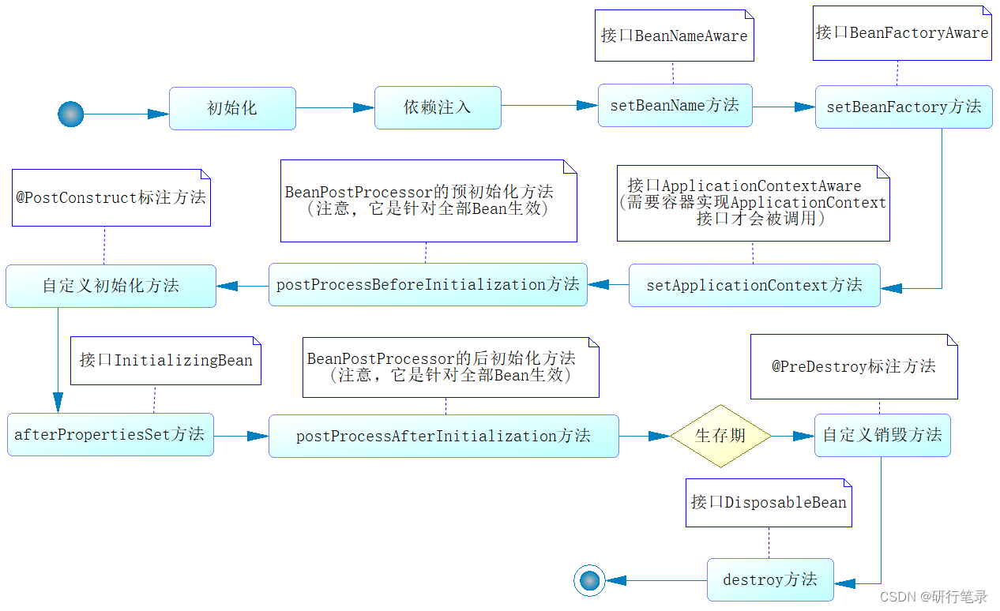

Java-web
---

## Spring

### 什么是 spring 框架？

一款开源的轻量级 Java 开发框架， 提高开发效率及系统可维护性。

两个核心部分： IOC 和 AOP

 - IOC：控制反转，把创建对象过程交给 Spring 进行管理
 - Aop：面向切面，不修改源代码进行功能增强

### 什么是Spring Bean?

Bean 代指的就是那些被 IoC 容器所管理的对象。

我们需要告诉 IoC 容器帮助我们管理哪些对象，这个是通过配置元数据来定义的。配置元数据可以是 XML 文件、注解或者 Java 配置类。

+ 管理Bean时常用的一些注解：

   - @ComponentScan用于声明扫描策略，通过它的声明，容器就知道要扫描哪些包下带有声明的类，也可以知道哪些特定的类是被排除在外的。
   - @Component、@Repository、@Service、@Controller用于声明Bean，它们的作用一样，但是语义不同。@Component用于声明通用的Bean，@Repository用于声明DAO层的Bean，@Service用于声明业务层的Bean，@Controller用于声明视图层的控制器Bean，被这些注解声明的类就可以被容器扫描并创建。
   
   - @Autowired、@Qualifier用于注入Bean，即告诉容器应该为当前属性注入哪个Bean。其中，@Autowired是按照Bean的类型进行匹配的，如果这个属性的类型具有多个Bean，就可以通过@Qualifier指定Bean的名称，以消除歧义。
   
   - @Scope用于声明Bean的作用域，默认情况下Bean是单例的，即在整个容器中这个类型只有一个实例。可以通过@Scope注解指定prototype值将其声明为多例的，也可以将Bean声明为session级作用域、request级作用域等等，但最常用的还是默认的单例模式。
   - @PostConstruct、@PreDestroy用于声明Bean的生命周期。其中，被@PostConstruct修饰的方法将在Bean实例化后被调用，@PreDestroy修饰的方法将在容器销毁前被调用。

### 注入 Bean 的注解有哪些？

Spring 内置的 @Autowired 以及 JDK 内置的 @Resource 和 @Inject 都可以用于注入 Bean。

### @Autowired 和 @Resource 的区别是什么？

 - @Autowired 是 Spring 提供的注解，@Resource 是 JDK 提供的注解。
 - Autowired 默认的注入方式为byType（根据类型进行匹配），@Resource默认注入方式为 byName（根据名称进行匹配）。
 - 当一个接口存在多个实现类的情况下，@Autowired 和@Resource都需要通过名称才能正确匹配到对应的Bean。Autowired 可以通过 @Qualifier 注解来显示指定名称，@Resource可以通过 name
   属性来显示指定名称。

### Bean 的作用域

   默认情况下，Bean在Spring容器中是单例的，我们可以通过@Scope注解修改Bean的作用域。该注解有如下5个取值，它们代表了Bean的5种不同类型的作用域：
   

### Bean的生命周期

   Spring容器管理Bean，涉及对Bean的创建、初始化、调用、销毁等一系列的流程，这个流程就是Bean的生命周期。
   

## Spring MVC

### 什么是MVC？

MVC是一种设计模式，在这种模式下软件被分为三层，即Model（模型）、View（视图）、Controller（控制器）。Model代表的是数据，View代表的是用户界面，Controller代表的是数据的处理逻辑，它是Model和View这两层的桥梁。将软件分层的好处是，可以将对象之间的耦合度降低，便于代码的维护。

### Spring MVC的核心组件有哪些？

- 前端控制器DispatcherServlet

  作用: SpringMVC的入口函数。接收请求，响应结果，相当于转发器，中央处理器。用户请求到达前端控制器，它就相当于MVC模式中的C, DispatcherServlet 是整个流程控制的中心，由它调用其它组件处理用户的请求，DispatcherServlet 的存在降低了组件之间的耦合性。

- 处理器映射器HandlerMapping

  作用: 根据 uri 去匹配查找能处理的 Handler ，并会将请求涉及到的拦截器和 Handler 一起封装。

- 处理器适配器HandlerAdapter

  作用:根据 HandlerMapping 找到的 Handler，适配执行对应的 Handler。通过HandlerAdapter 对处理器进行执行，这是适配器模式的应用，通过扩展适配器可以对更多类型的处理器进行执行。

- 请求处理器Handler

  处理实际请求的处理器

- 视图解析器View resolver

  作用: 根据 Handler 返回的逻辑视图 / 视图，解析并渲染真正的视图，并传递给 DispatcherServlet 响应客户端。

- 视图 View

  View是一个接口， 实现类支持不同的View类型(jsp、 freemarker…). 。

### Spring MVC的工作原理？

精简速记版:客户端(浏览器)发送请求->前端控制器DispatcherServlet接受客户端请求->找到处理器映射HandlerMapping解析请求对应的Handler -> HandlerAdapter会根据Handler来调用真正的处理器来处理请求，并处理相应的业务逻辑->处理器返回一个模型视图ModelAndView ->视图解析器进行解析->返回一个视图对象->前端控制器DispatcherServlet渲染数据(Model) >将得到视图对象返回给用户。

### Spring MVC常用的注解有哪些？

 - @RequestMapping：
   
     作用：该注解的作用就是用来处理请求地址映射的，也就是说将其中的处理器方法映射到url路径上。

 - @RequestParam：

   作用：是将请求参数绑定到你的控制器的方法参数上，是Spring MVC中的接收普通参数的注解。
 
 - @RequestBody：

   作用：如果作用在方法上，就表示该方法的返回结果是直接按写入的Http responsebody中。
 
 - @PathVaribale：

   作用：该注解是用于绑定url中的占位符，但是注意，spring3.0以后，url才开始支持占位符的，它是SpringMVC支持的rest风格url的一个重要的标志。
 
### Spring MVC的拦截器

   拦截器会对处理器进行拦截，这样通过拦截器就可以增强处理器的功能。Spring MVC中，所有的拦截器都需要实现HandlerInterceptor接口，该接口包含如下三个方法：preHandle()、postHandle()、afterCompletion()。

## MyBatis

### 谈谈你对 MyBatis 的理解？

   - Mybatis是一个半ORM (对象关系映射)框架，它内部封装了JDBC， 开发时只需要关注SQL语句本身,不需要花费精力去处理加载驱动、创建连接、创建Statement等繁杂的过程。程序员直接编写原生态SQL,可以严格控制SQL执行性能，灵活度高。
   - MyBatis 可以使用XML或注解来配置和映射原生信息，将POJO映射成数据库中的记录，避免了几乎所有的JDBC代码和手动设置参数以及获取结果集。
   - 通过XML文件或注解的方式将要执行的各种Statement配置起来，并通过Java对象和Statement中SQL的动态参数进行映射生成最终执行的SQL语句，最后由MyBatis 框架执行SQL并将结果映射为Java对象并返回。(从执行 SQL到返回Result 的过程)

### Mybatis的优缺点有哪些？ 
   
 优点：

 - 基于SQL语句编程，相当灵活，不会对应用程序或者数据库的现有设计造成任何影响，SQL写在XML里,解除SQL与程序代码的耦合，便于统一管理;提供XML标签，支持编写动态SQL语句，并可重用;
 - 与JDBC相比，减少了代码量,消除了JDBC大量冗余的代码，不需要手动开关连接;
 - 很好的与各种数据库兼容(因为MyBatis使用JDBC来连接数据库，所以只要JDBC支持的数据库MyBatis都支持);
 - 提供映射标签，支持对象与数据库的ORM字段关系映射;提供对象关系映射标签,支持对象关系组件维护。

缺点：

 - SQL语句的编写工作量较大，尤其当字段多、关联表多时，对开发人员编写SQL语句的功底有一-定要求;
 -  SQL语句依赖于数据库，导致数据库移植性差，不能随意更换数据库。

### MyBatis中的 $ 和 # 有什么区别？

1. 使用#设置参数时，MyBatis会创建预编译的SQL语句，然后在执行SQL时MyBatis会为预编译SQL中的占位符（?）赋值。预编译的SQL语句执行效率高，并且可以防止注入攻击。
2. 使用$设置参数时，MyBatis只是创建普通的SQL语句，然后在执行SQL语句时MyBatis将参数直接拼入到SQL里。
    
 `既然不安全，为什么还需要 不安全，为什么还需要不安全，为什么还需要，什么时候会用到它？ 
   可以解决一些特殊情况下的问题。例如，在一些动态表格（根据不同的条件产生不同的动态列）中，我们要传递SQL的列名，根据某些列进行排序，或者传递列名给SQL都是比较常见的场景，这就无法使用预编译的方式了。`

###  MyBatis 是如何进行行分页的？分页插件的原理理是什么？

1. MyBatis 使用 RowBounds 对象进行分页，它是针对 ResultSet 结果集执行的内存分页，而非物理分页；
 
2. 可以在 sql 内直接书写带有物理分页的参数来完成物理分页功能
 
3. 也可以使用分页插件来完成物理分页

`分页插件的基本原理：是使用 MyBatis 提供的插件接口，实现自定义插件，在插件的拦截方法内拦截待执行的 sql，然后重写 sql，根据 dialect 方言，添加对应的物理分页语句和物理分页参数。`

### MyBatis 逻辑分页和物理理分页的区别是什么？

1. 物理分页速度上并不一定快于逻辑分页，逻辑分页速度上也并不一定快于物理分页。

2. 物理分页总是优于逻辑分页:没有必要将属于数据库端的压力加到应用端来，就算速度上存在优势，然而其它性能上的优点足以弥补这个缺点。

### MyBatis缓存机制

MyBatis的缓存分为一级缓存和二级缓存。

- 一级缓存： 一级缓存也叫本地缓存，它默认会启用，并且不能关闭。一级缓存存在于SqlSession 的生命周期中，即它是SqlSession级别的缓存。在同一个 SqlSession 中查询时，MyBatis 会把执行的方法和参数通过算法生成缓存的键值，将键值和查询结果存入一个Map对象中。如果同一个SqlSession 中执行的方法和参数完全一致，那么通过算法会生成相同的键值，当Map 缓存对象中己经存在该键值时，则会返回缓存中的对象。
- 二级缓存:与一级缓存其机制相同，默认也是采用PerpetualCache, HashMap 存储，不同在于其存储作用域为 Mapper(Namespace),并且可自定义存储源，如Ehcache。默认不打开二级缓存，要开启二级缓存，使用二级缓存属性类需要实现Serializable序列化接口(可用来保存对象的状态)，可在它的映射文件中配置;

## Spring Boot

### 谈谈对Spring Boot的理解

Spring Boot使用“习惯优于配置”的理念让你的项目快速地运行起来，使用Spring Boot很容易创建一个能独立运行、准生产级别、基于Spring框架的项目，使用Spring Boot你可以不用或者只需要很少的Spring配置。

 Spring Boot本身并不提供Spring的核心功能，而是作为Spring的脚手架框架，以达到快速构建项目、预置三方配置、开箱即用的目的。

优点:

 - 可以快速构建项目；
 - 可以对主流开发框架的无配置集成,简化配置、自动配置；
 - 项目可独立运行，无需外部依赖Servlet容器；
 - 提供运行时的应用监控；
 - 可以极大地提高开发、部署效率；
 - 可以与云计算天然集成。

### Spring Boot Starter有什么用？

   Spring Boot通过提供众多起步依赖（Starter）降低项目依赖的复杂度。起步依赖本质上是一个Maven项目对象模型（Project Object Model, POM），定义了对其他库的传递依赖，这些东西加在一起即支持某项功能。很多起步依赖的命名都暗示了它们提供的某种或某类功能。

### 介绍Spring Boot的启动流程

   Spring Boot项目创建完成会默认生成一个名为 *Application 的入口类，我们是通过该类的main方法启动Spring Boot项目的。在main方法中，通过SpringApplication的静态方法，即run方法进行SpringApplication类的实例化操作，然后再针对实例化对象调用另外一个run方法来完成整个项目的初始化和启动。

### Spring Boot 的核心注解？

- @SpringBootConfiguration: 组合了@Configuration注解，实现配置文件的功能
- @EnableAutoConfiguration: 打开自动配置的功能，也可以关闭某个自动配置的选项，如关闭数据源自动配置功能:@SpringBootApplication(exclude = {DataSourceAutoConfiguration.class})。
- @ComponentScan: Spring组件扫描。
- @Conditional注解，不同之处是它们在注解中指定的条件（Condition）不同

### SpringBoot 自动配置

#### 自动配置过程

Spring Boot实现该运作机制锁涉及的核心部分如下图所示：

1. Spring Boot通过@EnableAutoConfiguration注解开启自动配置，加载spring.factories中注册的各种AutoConfiguration类
2. 当某个AutoConfiguration类满足其注解@Conditional指定的生效条件（Starters提供的依赖、配置或Spring容器中是否存在某个Bean等）时，实例化该AutoConfiguration类中定义的Bean（组件等），并注入Spring容器，就可以完成依赖框架的自动配置。

#### 自动配置原理

1. SpringBoot启动会加载大量的自动配置类
2. 我们看我们需要的功能有没有在SpringBoot默认写好的自动配置类当中;
3. 我们再来看这个自动配置类中到底配置了哪些组件; (只要我们要 用的组件存在在其中，我们就不需要再手动配置了)
4. 给容器中自动配置类添加组件的时候，会从properties类中获取某些属性。我们只需要在配置文件中指定这些属性的值即可; xxxAutoConfigurartion: 自动配置类;给容器中添加组件

### SpringBoot、Spring MVC和Spring有什什么区别？

- Spring 
  
    Spring最重要的特征是依赖注入。所有Spring Modules不是依赖注入就是IOC控制反转。当我们恰当的使用DI或者是IOC的时候，可以开发松耦合应用
- Spring MVC 
  
    SpringMVC提供了一种分离式的方法来开发Web应用。通过运用像DispatcherServelet,MoudIAndView和ViewResolver等一些简单的概念，开发Web应用将会变的非常简单。
- SpringBoot 
  
    Spring和Spring MVC的问题在于需要配置大量的参数。SpringBoot通过一个自动配置和启动的项来解决这个问题。

### 什么是YAML? 优势在哪？

**概念**：YAML是一种人类可读的**数据序列化语言**。它通常用于配置文件。与属性文件相比，如果我们想要在配置文件中添加复杂的属性，YAML 文件就更加结构化，而且更少混淆。可以看出YAML具有分层配置数据。

**优势**：

1. 配置有序，在一些特殊的场景下，配置有序很关键
2. 支持数组，数组中的元素可以是基本数据类型也可以是对象
3. 简洁

**缺点**：相比properties配置文件，不支持@PropertySource注解导入自定义的YAML配置。

## 其他内容

### cookie和session的区别是什么？

- 存储位置不同：cookie存放于**客户端**；session存放于**服务端**。
- 存储容量不同：单个cookie保存的数据<=4KB，一个站点最多保存20个cookie；而session并**没有上限**。
- 存储方式不同：cookie只能保存**ASCII字符串**，并需要通过编码当时存储为Unicode字符或者**二进制数据**；session中能够存储**任何类型的数据**，例如字符串、整数、集合等。
- 隐私策略不同：cookie对**客户端是可见的**，别有用心的人可以分析存放在本地的cookie并进行cookie欺骗，所以它是不安全的；session存储在服务器上，**对客户端是透明的**，不存在敏感信息泄露的风险。
- 生命周期不同：可以通过**设置cookie的属性，达到cookie长期有效的效果**；session依赖于名为JSESSIONID的cookie，而该cookie的默认过期时间为-1，只需**关闭窗口该session就会失效**，因此session不能长期有效。
- 服务器压力不同：cookie保存在客户端，**不占用服务器资源**；session保管在服务器上，每个用户都会产生一个session，如果**并发量大的话，则会消耗大量的服务器内存**。
- 浏览器支持不同：cookie是需要**浏览器支持的**，如果客户端禁用了cookie，则会话跟踪就会失效；运用session就需要使用**URL重写**的方式，所有用到session的URL都要进行重写，否则session会话跟踪也会失效。
- 跨域支持不同：cookie**支持**跨域访问，session**不支持**跨域访问。

### Cookie和Session各自适合的场景是什么？

- 对于敏感数据，应存放在session里，因为cookie不安全。
- 对于普通数据，优先考虑存放在cookie里，这样会减少对服务器资源的占用。

### Session的工作原理

**session依赖于cookie。**

- 当客户端首次访问服务器时，服务器会为其创建一个session对象，该对象具有一个唯一标识SESSIONID。并且在响应阶段，服务器会创建一个cookie，并将SESSIONID存入其中。
- 客户端通过响应的cookie而持有SESSIONID，所以当它再次访问服务器时，会通过cookie携带这个SESSIONID。服务器获取到SESSIONID后，就可以找到与之对应的session对象，进而从这个session中获取该客户端的状态。

### Get请求与Post请求有什么区别？

- Get是从服务器上获取数据，Post是向服务器提交数据。
- GET请求把参数包含在URL中，将请求信息放在URL后面，POST请求通过request body传递参数，将请求信息放置在报文体中。
- Get传送的数据量较小，不能大于2KB。 Post传送的数据量较大，一般被默认为不受限制。
- Get安全性非常低，Get设计成传输数据，一般都在地址栏里面可以看到，Post安全性较高，Post传递数据比较隐私，所以在地址栏看不到，如果没有加密，他们安全级别都是一样的，随便一个监听器都可以把所有的数据监听到。
- GET请求能够被缓存，GET请求会保存在浏览器的浏览记录中，以GET请求的URL能够保存为浏览器书签，Post请求不具有这些功能。

